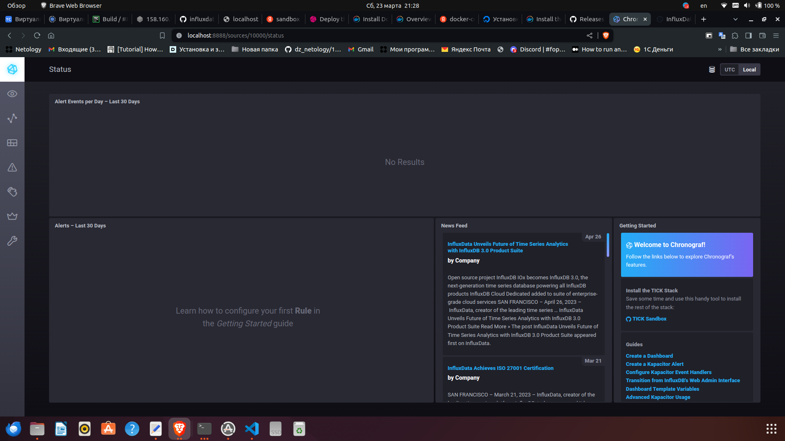
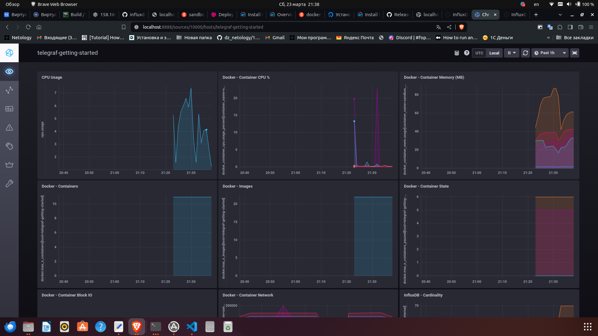
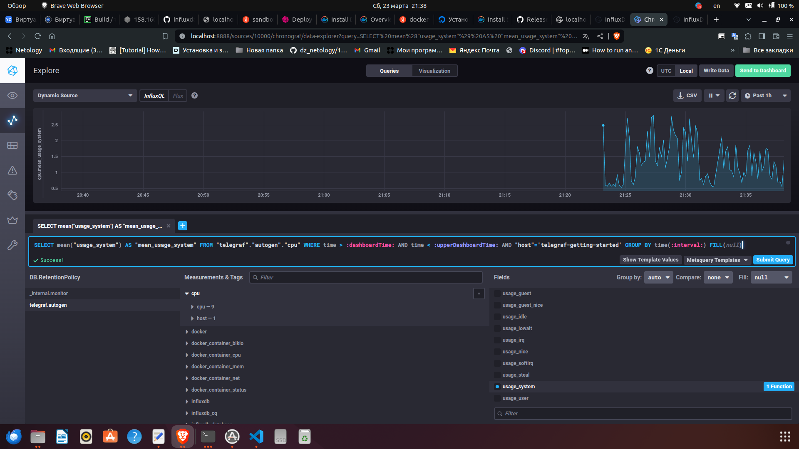
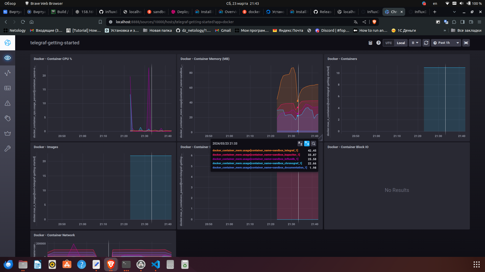
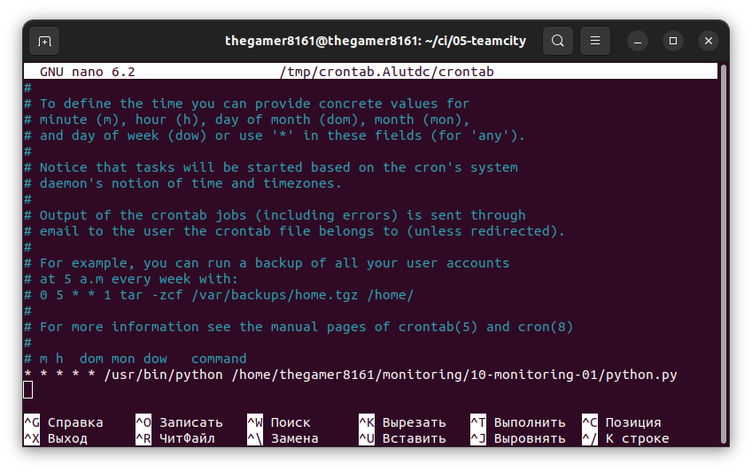
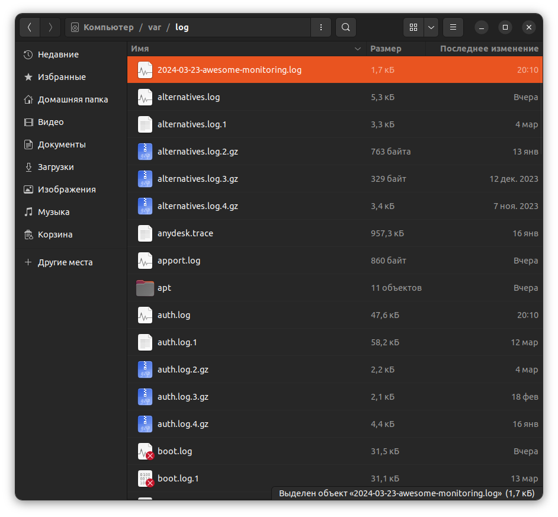

# Никоноров Денис - FOPS-8
# Домашнее задание к занятию "13.Системы мониторинга"

## Обязательные задания

1. Вас пригласили настроить мониторинг на проект. На онбординге вам рассказали, что проект представляет из себя платформу для вычислений с выдачей текстовых отчётов, которые сохраняются на диск. 
Взаимодействие с платформой осуществляется по протоколу http. Также вам отметили, что вычисления загружают ЦПУ. Какой минимальный набор метрик вы выведите в мониторинг и почему?

<details>
	<summary>Ответ</summary>

	1. Метрика производитетльности
	- Загрузка CPU: Средня, пиковая
	- Использование памяти: RAM/swap
	- IOPS: получение информации о кол-ве операций с диском в сек.
	- inodes: получение  информации о переполнении индексных дескрипторов
	2. Метрики доступности
	- Uptime: Процент времени, в течени которого сервер был доступен.
	- Downtime: Процент времени, в течении которого сервер был не доступен.
	- HTTP response status 200 or 500.
	- Процент ошибок 500
	
	- Срок жизни TLS сертификата

</details>

2. Менеджер продукта, посмотрев на ваши метрики, сказал, что ему непонятно, что такое RAM/inodes/CPUla. Также он сказал, что хочет понимать, насколько мы выполняем свои обязанности перед клиентами и какое качество обслуживания. Что вы можете ему предложить?

<details>
	<summary>Ответ</summary>

	1. Обяснить менеджеру продукта что такое RAM/inodes/CPUla:
	- RAM: Оперативная память, используемая созданным приложением
	- inodes: индексный дескриптор у каждого файла он есть
	- CPU LA : как приложение нагружает центральный процессор

	SLO - целевой уровень качества обслуживания.
	SLA - соглашение об уровне обслуживания.
	SLI - индикатор качества обслуживания. Конкретная величина предоставляемого обслуживания.

	Расчет SLI = (summ_2xx_requests + summ_3xx_requests)/(summ_all_requests)

</details>

3. Вашей DevOps-команде в этом году не выделили финансирование на построение системы сбора логов. Разработчики, в свою очередь, хотят видеть все ошибки, которые выдают их приложения. Какое решение вы можете предпринять в этой ситуации, чтобы разработчики получали ошибки приложения?

<details>
	<summary>Ответ</summary>

	Использовать для построения системы сбора логов opencource продукты. Такие как Sentry и Prometheus

</details>

4. Вы, как опытный SRE, сделали мониторинг, куда вывели отображения выполнения SLA = 99% по http-кодам ответов. 
Этот параметр вычисляется по формуле: summ_2xx_requests/summ_all_requests. Он не поднимается выше 70%, но при этом в вашей системе нет кодов ответа 5xx и 4xx. Где у вас ошибка?

<details>
	<summary>Ответ</summary>

	Ошибка в формуле вычесления.
	Формула должна выглядеть так:
	
	(summ_1xx_requests + summ_2xx_requests + summ_3xx_requests)/(summ_all_requests)

</details>

5. Опишите основные плюсы и минусы pull и push систем мониторинга.

<details>
	<summary>Ответ</summary>

	Плюсы push-модели:
	1. Упрашение репликации данных в разные системы мониторинга или их резервные копии
	2. Более гибкие настройки отправки пакетов данных с метриками
	3. UDP - это менее затратный способ передачи данных, из-за чего может возрасти производительность сбора метрик.

	Плюсы pull-модели:
	1. Легче контролировать подлинность данных.
	2. Можно настроить proxy сервер до всех агентов с TLS.
	3. Упрощенная отладка получения данных с агентов.

	Миннусы push-модели:
	1. Большое подключение агентов на один сервер.
	2. UDP не гарантирует доставку данных

	Минусы pull-модели:
	1. Открытие порта для сбора метрик на каждом узле
	2. Ведение списка узлов для мониторинга

</details>

6. Какие из ниже перечисленных систем относятся к push модели, а какие к pull? А может есть гибридные?

    - Prometheus 
    - TICK
    - Zabbix
    - VictoriaMetrics
    - Nagios

<details>
	<summary>Ответ<summary>

	Prometheus работает в соответствии с pull-моделью
	TICK работает в соответствии с push-моделью
	Zabbix работает в соответствии с push- и pull-моделью (является гибридной)
	VictoriaMetrics работает в соответствии с pull-моделью
	Nagios работает в соответствии с pull-моделью

</details>

7. Склонируйте себе [репозиторий](https://github.com/influxdata/sandbox/tree/master) и запустите TICK-стэк, 
используя технологии docker и docker-compose.

В виде решения на это упражнение приведите скриншот веб-интерфейса ПО chronograf (`http://localhost:8888`).



8. Перейдите в веб-интерфейс Chronograf (http://localhost:8888) и откройте вкладку Data explorer.
        
    - Нажмите на кнопку Add a query
    - Изучите вывод интерфейса и выберите БД telegraf.autogen
    - В `measurments` выберите cpu->host->telegraf-getting-started, а в `fields` выберите usage_system. Внизу появится график утилизации cpu.
    - Вверху вы можете увидеть запрос, аналогичный SQL-синтаксису. Поэкспериментируйте с запросом, попробуйте изменить группировку и интервал наблюдений.

Для выполнения задания приведите скриншот с отображением метрик утилизации cpu из веб-интерфейса.




9. Изучите список [telegraf inputs](https://github.com/influxdata/telegraf/tree/master/plugins/inputs). 
Добавьте в конфигурацию telegraf следующий плагин - [docker](https://github.com/influxdata/telegraf/tree/master/plugins/inputs/docker):
```
[[inputs.docker]]
  endpoint = "unix:///var/run/docker.sock"
```

Дополнительно вам может потребоваться донастройка контейнера telegraf в `docker-compose.yml` дополнительного volume и 
режима privileged:
```
  telegraf:
    image: telegraf:1.4.0
    privileged: true
    volumes:
      - ./etc/telegraf.conf:/etc/telegraf/telegraf.conf:Z
      - /var/run/docker.sock:/var/run/docker.sock:Z
    links:
      - influxdb
    ports:
      - "8092:8092/udp"
      - "8094:8094"
      - "8125:8125/udp"
```

После настройке перезапустите telegraf, обновите веб интерфейс и приведите скриншотом список `measurments` в 
веб-интерфейсе базы telegraf.autogen . Там должны появиться метрики, связанные с docker.

Факультативно можете изучить какие метрики собирает telegraf после выполнения данного задания.



## Дополнительное задание* (со звёздочкой) 

Выполнение этого задания необязательно и никак не влияет на получение зачёта по домашней работе.

_____

Вы устроились на работу в стартап. На данный момент у вас нет возможности развернуть полноценную систему 
мониторинга, и вы решили самостоятельно написать простой python3-скрипт для сбора основных метрик сервера. 

Вы, как опытный системный администратор, знаете, что системная информация сервера лежит в директории `/proc`. Также знаете, что в системе Linux есть  планировщик задач cron, который может запускать задачи по расписанию.

Суммировав всё, вы спроектировали приложение, которое:

- является python3-скриптом;
- собирает метрики из папки `/proc`;
- складывает метрики в файл 'YY-MM-DD-awesome-monitoring.log' в директорию /var/log 
(YY — год, MM — месяц, DD — день);
- каждый сбор метрик складывается в виде json-строки, в виде:
  + timestamp — временная метка, int, unixtimestamp;
  + metric_1 — метрика 1;
  + metric_2 — метрика 2;
  
     ...
     
  + metric_N — метрика N.
  
- сбор метрик происходит каждую минуту по cron-расписанию.

Для успешного выполнения задания нужно привести:

* работающий код python3-скрипта;
* конфигурацию cron-расписания;
* пример верно сформированного 'YY-MM-DD-awesome-monitoring.log', имеющий не меньше пяти записей.

Дополнительная информация:

1. Количество собираемых метрик должно быть не меньше четырёх.
1. По желанию можно не ограничивать себя только сбором метрик из `/proc`.

[Ссылка на скрипт python](python.py)

Запуск cron от рута тк если будет запуск от пользователя будет ошибка `permision denied`
Это было сделано для теста

```shell
sudo crontab -eu root
```
Желательно создать пользователя для работы cron с доступом к /proc/..



Имя сформированного файла


<details>
	<summary>Метрики 2024-03-23-awesome-monitoring.log</summary>

```json
	{
    "timestamp": 1711210021,
    "cpu": {
        "model": "AMD Ryzen 7 4700U with Radeon Graphics",
        "cores": 8,
        "freq": 1.3972149999999999
    },
    "memory": {
        "total": 15344.2109375,
        "free": 2554.62890625,
        "available": 7734.57421875
    },
    "disk": {
        "reads": 3722,
        "writes": 0,
        "read_bytes": 260388,
        "write_bytes": 0
    },
    "uptime": 112282.3
}
{
    "timestamp": 1711210081,
    "cpu": {
        "model": "AMD Ryzen 7 4700U with Radeon Graphics",
        "cores": 8,
        "freq": 4.180757
    },
    "memory": {
        "total": 15344.2109375,
        "free": 2378.921875,
        "available": 7558.7265625
    },
    "disk": {
        "reads": 3722,
        "writes": 0,
        "read_bytes": 260388,
        "write_bytes": 0
    },
    "uptime": 112342.33
}
{
    "timestamp": 1711210141,
    "cpu": {
        "model": "AMD Ryzen 7 4700U with Radeon Graphics",
        "cores": 8,
        "freq": 1.397246
    },
    "memory": {
        "total": 15344.2109375,
        "free": 1963.94140625,
        "available": 7144.30859375
    },
    "disk": {
        "reads": 3727,
        "writes": 0,
        "read_bytes": 260410,
        "write_bytes": 0
    },
    "uptime": 112402.38
}
{
    "timestamp": 1711210202,
    "cpu": {
        "model": "AMD Ryzen 7 4700U with Radeon Graphics",
        "cores": 8,
        "freq": 1.4
    },
    "memory": {
        "total": 15344.2109375,
        "free": 1777.78515625,
        "available": 6958.53515625
    },
    "disk": {
        "reads": 3727,
        "writes": 0,
        "read_bytes": 260410,
        "write_bytes": 0
    },
    "uptime": 112462.44
}
{
    "timestamp": 1711210261,
    "cpu": {
        "model": "AMD Ryzen 7 4700U with Radeon Graphics",
        "cores": 8,
        "freq": 1.3967829999999999
    },
    "memory": {
        "total": 15344.2109375,
        "free": 1725.66796875,
        "available": 6906.87109375
    },
    "disk": {
        "reads": 3727,
        "writes": 0,
        "read_bytes": 260410,
        "write_bytes": 0
    },
    "uptime": 112521.49
}
{
    "timestamp": 1711210321,
    "cpu": {
        "model": "AMD Ryzen 7 4700U with Radeon Graphics",
        "cores": 8,
        "freq": 1.397301
    },
    "memory": {
        "total": 15344.2109375,
        "free": 2172.71875,
        "available": 7354.1171875
    },
    "disk": {
        "reads": 3727,
        "writes": 0,
        "read_bytes": 260410,
        "write_bytes": 0
    },
    "uptime": 112581.55
}
```

</details>

---